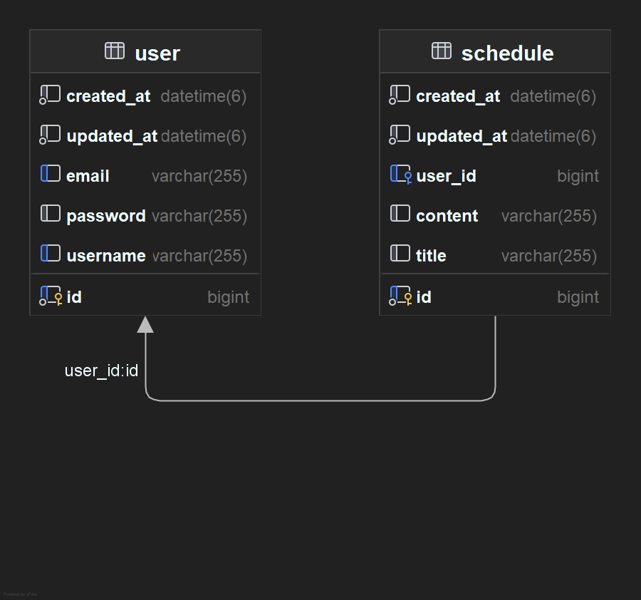

# 프로젝트 소개
일정 CRUD, 유저 CRUD, 유저 로그인 로그아웃 기능을 구현 해보았습니다.

## 개발 기간
- 2025.02.06 ~ 2025.02.13
- 문제 분석
- 일정과 유저간의 연관관계 파악
- 코딩 및 테스트

## 개발자 소개
- **명민준** : 프로젝트 총괄 및 개발
- 명민준 : ~~나날이 힘들어지는 사람~~

## 개발 환경
- **Version** : Java 17
- **IDE** : IntelliJ
  
## 주요 기능
- **일정 생성, 조회, 수정, 삭제**
  * 일정의 기본적인 기능인 생성, 조회, 수정, 삭제를 수행할 수 있게 개발했습니다.
- **유저 생성, 조회, 수정, 삭제**
  * 유저의 기본적인 기능인 생성, 조회, 수정, 삭제를 수행할 수 있게 개발했습니다.
- **유저 로그인, 로그아웃**
  * 유저가 로그인과 로그아웃을 할 수 있게 개발했습니다.
- **필터 기능 구현**
  * 로그인한 유저만 일정을 생성, ID를 이용해 일정을 조회할 수 있도록 개발했습니다..
 
# 마무리
- 필수까지 구현하는데에도 많은 어려움이 있었습니다, 특히 인증,인가 부분에서 많이 헤메었지만 잘 해낸것 같습니다.
- 어떤 계정으로도 로그인하면 다른 계정을 삭제할 수 있는 부분은 추가로 개발해야 할 것 같습니다.

## 1. 일정 API 설계하기
| 기능          | method | endpoint          | request  | response |
|-------------|--------|-------------------|----------|----------|
| 유저 생성       | `POST`   | `/users/signup`   | 요청 body  | 등록 정보    |
| 유저 로그인      | `POST`   | `/auth/login`     | 요청 body  | 등록 정보    |
| 유저 로그아웃     | `POST`   | `/auth/logout`    | 요청 body  | 등록 정보    |
| 유저 조회    | `GET`  | `/users/{id}` | 요청 param | 단건 응답 정보 |
| 유저 비밀번호 변경  | `PATCH`   | `/users/{id}`       | 요청 body  | 등록 정보    |
| 유저 삭제       | `DELETE` | `/users/{id}` | 요청 param | -        |
| 새로운 일정 생성   | `POST`   | `/schedules`      | 요청 body  | 등록 정보    |
| 일정 단건 조회    | `GET`  | `/schedules/{id}` | 요청 param | 단건 응답 정보 |
| 일정 다건 조회    | `GET`  | `/schedules`      | 요청 param | 다건 응답 정보 |
| 일정 단건 전체 수정 | `PUT`  | `/schedules/{id}` | 요청 body  | 수정 정보    |
| 일정 삭제       | `DELETE` | `/schedules/{id}` | 요청 param | -        |

